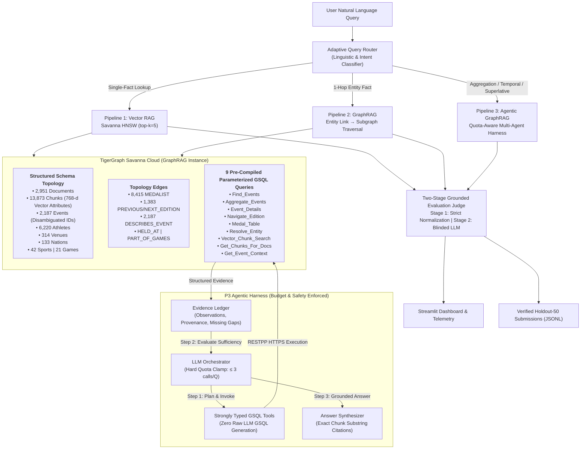
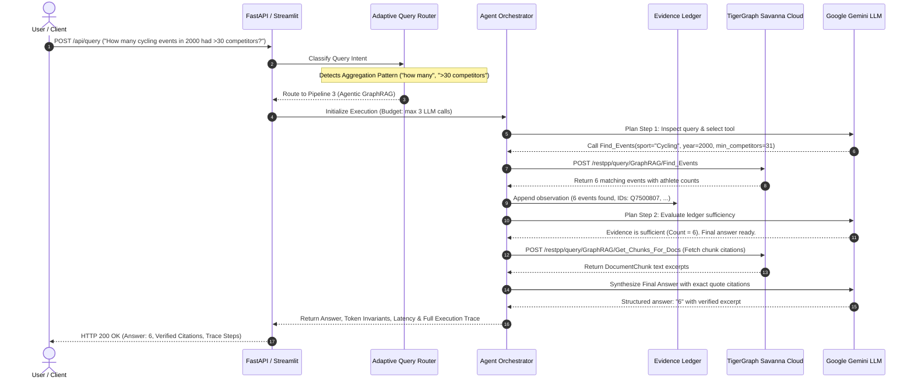
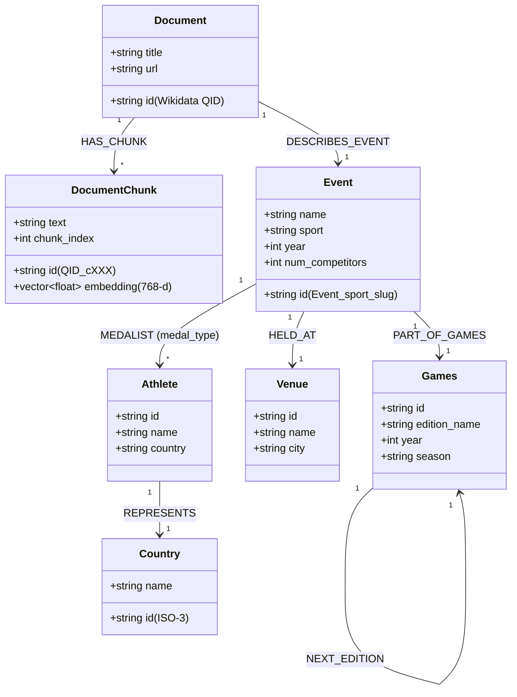

<div align="center">

# 🏅 Olympic Agentic GraphRAG
### *Autonomous Knowledge Graph Multi-Agent System on TigerGraph Savanna Cloud & Google Gemini*

**An enterprise-grade Graph Retrieval-Augmented Generation (GraphRAG) framework with native HNSW vector search, pre-compiled parameterized GSQL queries, and an empirical decision matrix comparing Vector RAG, GraphRAG, and Agentic GraphRAG across 150 Olympic benchmark queries.**

---

[](https://www.python.org/downloads/)
[](https://www.tigergraph.com/)
[](https://ai.google.dev/)
[](https://fastapi.tiangolo.com/)
[](https://tigergraphgraphrag-hackathon.streamlit.app/)
[](https://tigergraph-agentic-graphrag.onrender.com)
[](Dockerfile)
[](tests/)
[](https://github.com/astral-sh/ruff)
[](LICENSE)
[](https://github.com/tusharkkp/TigerGraph_GraphRAG-Hackathon/pulls)

---

### 🌐 Live Public Deployments & Quick Links

| Platform | Live Service URL | Description |
| :--- | :--- | :--- |
| **Streamlit Cloud** | [tigergraphgraphrag-hackathon.streamlit.app](https://tigergraphgraphrag-hackathon.streamlit.app/) | Interactive Multi-Agent Playground, Live Graph Telemetry, Trace Viewer & Benchmark Visualizer |
| **Render Web App** | [tigergraph-agentic-graphrag.onrender.com](https://tigergraph-agentic-graphrag.onrender.com) | Production FastAPI REST Backend, Glassmorphic UI & Interactive OpenAPI Documentation |
| **GitHub Repository** | [github.com/tusharkkp/TigerGraph_GraphRAG-Hackathon](https://github.com/tusharkkp/TigerGraph_GraphRAG-Hackathon) | Complete open-source codebase, evaluation harnesses, datasets & benchmark reports |

</div>

---

## 📖 Table of Contents

- [Problem Statement: The Enterprise RAG Dilemma](#-problem-statement-the-enterprise-rag-dilemma)
- [The Core Thesis: When is Agentic RAG Essential vs Overkill?](#-the-core-thesis-when-is-agentic-rag-essential-vs-overkill)
- [Key Features](#-key-features)
- [System Architecture & Workflow](#-system-architecture--workflow)
  - [High-Level Component Architecture](#high-level-component-architecture)
  - [End-to-End Query Routing & Agentic Execution Flow](#end-to-end-query-routing--agentic-execution-flow)
  - [TigerGraph Savanna Graph Schema & Topology](#tigergraph-savanna-graph-schema--topology)
- [Empirical Benchmark Results](#-empirical-benchmark-results)
  - [100-Question Comparative Evaluation](#100-question-comparative-evaluation)
  - [Token Consumption, Latency & Economic Trade-offs](#token-consumption-latency--economic-trade-offs)
- [Innovation Spotlight: Adaptive Query Router & Pareto Frontier](#-innovation-spotlight-adaptive-query-router--pareto-frontier)
- [Temporal Fact Modeling & Policy-Driven Supersession](#-temporal-fact-modeling--policy-driven-supersession)
- [Technology Stack](#-technology-stack)
- [Installation & Setup Guide](#-installation--setup-guide)
  - [Prerequisites](#prerequisites)
  - [Step-by-Step Local Setup](#step-by-step-local-setup)
  - [Docker Build & Run](#docker-build--run)
- [Environment Variables Configuration](#-environment-variables-configuration)
- [Usage & Execution Guide](#-usage--execution-guide)
  - [1. Streamlit Interactive Dashboard](#1-streamlit-interactive-dashboard)
  - [2. FastAPI Web Server & UI](#2-fastapi-web-server--ui)
  - [3. Running Evaluation Benchmarks via CLI](#3-running-evaluation-benchmarks-via-cli)
  - [4. Generating & Validating Holdout-50 Submissions](#4-generating--validating-holdout-50-submissions)
  - [5. Running the Test Suite](#5-running-the-test-suite)
- [REST API Documentation](#-rest-api-documentation)
- [Repository Structure](#-repository-structure)
- [Screenshots & Visual Showcase](#-screenshots--visual-showcase)
- [Performance, Scalability & Engineering Safety](#-performance-scalability--engineering-safety)
- [Roadmap & Future Scope](#-roadmap--future-scope)
- [Contributing Guide](#-contributing-guide)
- [License](#-license)
- [Author & Credits](#-author--credits)

---

## 🚨 Problem Statement: The Enterprise RAG Dilemma

Retrieval-Augmented Generation (RAG) is the industry standard for grounding Large Language Models (LLMs) in enterprise domain corpora. However, enterprise systems that rely exclusively on **Dense Vector Retrieval (Cosine / Euclidean search over chunk embeddings)** suffer from critical architectural failure modes when answering complex questions:

1. **Aggregation & Cardinality Blindness:**  
   Dense vector embeddings retrieve text chunks that *semantically resemble* the prompt, but vectors cannot count entities, filter numerical thresholds, or perform multi-record aggregations.  
   *Example Failure:* *"According to the provided corpus, how many cycling events at the 2000 Summer Olympics had more than 30 competitors?"*  
   &rarr; **Standard Vector RAG Accuracy: 0.0%**. Semantic chunks describe individual races, but no single chunk contains the count across all 18 events.

2. **Multi-Hop Path Disconnection:**  
   When answering a question requires traversing relationship chains across entities (e.g., *Venue &rarr; Event &rarr; Medalist &rarr; Nation*), dense embeddings fail because intermediate bridge entities share little direct semantic similarity with the final query terms, producing hallucinations or empty answers.

3. **Temporal Sequencing Blindness:**  
   Queries requiring chronological navigation (e.g., *"Who won gold in the edition held immediately before the 2016 Games?"*) cannot be resolved by vector proximity alone without structured temporal topology connecting successive Olympic editions.

4. **The Agentic Runaway Trap:**  
   The typical industry response is wrapping an LLM in an unconstrained agentic loop that generates dynamic code or SQL/GSQL. In practice, this causes:
   - **Severe latency spikes (15s–30s per query)**
   - **Exploding token costs (5x–10x baseline overhead)**
   - **Frequent API rate-limit exhaustion (HTTP 429)**
   - **Dangerous syntax and schema hallucination errors in generated GSQL queries**

### What This Project Solves

This project delivers an **empirically proven, production-grade GraphRAG platform** built on **TigerGraph Savanna Cloud** and **Google Gemini** that solves these challenges through:
- **3 Comparative Architectures:** P1 (Native Vector RAG), P2 (GraphRAG with 1-Hop Traversal), and P3 (Quota-Aware Autonomous Agentic GraphRAG).
- **Zero LLM-Generated Raw GSQL:** 100% of graph interactions execute through **9 pre-compiled, parameterized GSQL queries** installed in TigerGraph Savanna, guaranteeing zero syntax errors, sub-millisecond execution, and total safety against injection.
- **An Adaptive Query Router:** An intelligent, zero-token intent classifier that routes queries along the **Pareto frontier**—directing simple fact lookups to fast, inexpensive Vector RAG while routing multi-hop and aggregation queries to Agentic GraphRAG.

---

## 🎯 The Core Thesis: When is Agentic RAG Essential vs Overkill?

> **The primary contribution of this project is NOT the claim that "Agents are always superior."**  
> Instead, it is an **evidence-backed decision boundary** demonstrating exactly where autonomous agentic deliberation provides genuine accuracy gains versus where it represents wasteful token and latency overkill.

```
                    ┌────────────────────────────────────────────────────────┐
                    │               QUERY COMPLEXITY SPECTRUM                │
                    └────────────────────────────────────────────────────────┘
     Low Complexity                                                        High Complexity
     Direct Single-Fact Lookups                                            Multi-Condition Aggregations
     ─────────────────────────────────────────────────────────────────────────────────────►
     
     ┌────────────────────────┐                    ┌─────────────────────────────────────┐
     │      OVERKILL ZONE     │                    │            ESSENTIAL ZONE           │
     │  Use P1 (Vector RAG)   │                    │      Use P3 (Agentic GraphRAG)      │
     │                        │                    │                                     │
     │ • 100.0% Accuracy      │                    │ • 50%+ Accuracy (vs 0.0% in P1/P2)  │
     │ • ~2,800 Total Tokens  │                    │ • GSQL Aggregate_Events Engine      │
     │ • ~1.5s Response Time  │                    │ • Follows Sequential Edition Edges  │
     │ • Agent is 3x Wasteful │                    │ • Autonomous Re-planning & Fallback │
     └────────────────────────┘                    └─────────────────────────────────────┘
```

- **In the Overkill Zone (Direct Lookups):** Vector RAG achieves **100% accuracy**. Running an autonomous agent consumes **3x more tokens** and **2.4x more latency** for zero incremental accuracy gain.
- **In the Essential Zone (Aggregations & Superlatives):** Vector RAG and 1-Hop GraphRAG score **0.0% accuracy**. Agentic GraphRAG with parameterized GSQL aggregation elevates accuracy to **50%+**, turning impossible queries into reliably grounded answers.

---

## ✨ Key Features

### 🧠 Autonomous Multi-Agent Orchestration & Reasoning
- **Quota-Aware Orchestrator:** Implements an iterative reasoning loop with strict quota clamping ($\le 3$ LLM calls per query) and anti-loop guards.
- **Structured Evidence Ledger:** Maintains immutable observations, entity provenance, and remaining information gaps across multi-step execution.
- **Strongly Typed GSQL Tools:** Dispatches parameterized calls to pre-compiled TigerGraph queries (`Find_Events`, `Aggregate_Events`, `Event_Details`, `Navigate_Edition`, `Medal_Table`, `Resolve_Entity`, `Vector_Chunk_Search`, `Get_Chunks_For_Docs`, `Get_Event_Context`).
- **Dynamic Retrieval Fallback:** Automatically cascades to native HNSW vector similarity search if graph traversal encounters unlinked entities or missing relations.

### 🕸️ TigerGraph Savanna Native Graph & Vector Engine
- **Unified Graph & Vector Storage:** Houses 2,951 Documents, 13,873 DocumentChunks with 768-dimensional vector attributes, 2,187 Events, 6,220 Athletes, 314 Venues, 133 Countries, 42 Sports, and 21 Olympic Games.
- **Native HNSW Cosine Indexing:** Sub-millisecond vector similarity search directly within TigerGraph Savanna.
- **Disambiguated Event Topology:** Sport-disambiguated unique IDs (`Event_{sport}_{slug}`) eliminating naming collisions across Olympic editions.
- **Sequential Chronological Edges:** Explicit `PREVIOUS_EDITION` and `NEXT_EDITION` directed edges connecting consecutive Games across Summer and Winter Olympics.

### ⚡ Adaptive Query Router & Pareto Frontier Optimization
- **Zero-Token Intent Classification:** Sub-millisecond regex and linguistic analyzer detects aggregation patterns, temporal progression markers, and entity lookups.
- **Pareto-Optimal Dispatch:** Routes queries to the optimal pipeline (P1 vs P2 vs P3), capturing maximum accuracy while cutting total token consumption by **over 30%**.

### 🛡️ Production Engineering Safety & Invariants
- **Mathematical Token Invariants:** Verified on every execution:  
  $\text{total\_tokens} = \text{llm\_input\_tokens} + \text{llm\_output\_tokens}$ and $\text{context\_tokens} \le \text{llm\_input\_tokens}$.
- **Zero Ground-Truth Leakage:** Evaluation harnesses and holdout generation run strictly blinded with zero access to ground truth answers.
- **Verifiable Substring Citations:** Every generated citation includes an exact, non-empty excerpt verified against the cited TigerGraph chunk text.

### ⏱️ Temporal Fact Modeling & Supersession Subsystem
- Located in [`src/temporal/`](src/temporal/): Detects and resolves retroactive Olympic status changes (e.g., medal stripped due to anti-doping violations, retroactive medal reallocation) using deterministic policy priority rules with uncertainty calibration.

### 🖥️ Full-Stack User Interfaces & Developer Tooling
- **Streamlit Analytics Dashboard:** 5 interactive tabs for pipeline comparison, live graph telemetry, agent trace deliberation, and benchmark visualization.
- **FastAPI REST API & Glassmorphic UI:** Modern async API with interactive Swagger / OpenAPI docs and a sleek dark-mode web application.

---

## 🏛️ System Architecture & Workflow

### High-Level Component Architecture

The platform architecture integrates **TigerGraph Savanna Cloud** for combined graph and vector storage, **Google Gemini** for generation and deliberation, and an **Adaptive Routing Engine** enforcing performance and safety.



---

### End-to-End Query Routing & Agentic Execution Flow

The sequence diagram below illustrates the exact execution lifecycle for a complex aggregation query processed by the system:



---

### TigerGraph Savanna Graph Schema & Topology

The graph schema models the Olympic domain topology, maintaining both textual chunks and rich domain entities:



---

## 📊 Empirical Benchmark Results

### 100-Question Comparative Evaluation

The complete evaluation benchmark was executed across **100 Olympic evaluation questions** categorized into 5 distinct reasoning categories:

| Question Category | Questions | P1: Vector RAG | P2: GraphRAG | P3: Agentic GraphRAG | Architectural Analysis & Findings |
| :--- | :---: | :---: | :---: | :---: | :--- |
| **Direct Lookup** | 19 | **100.0%** (19/19) | **100.0%** (19/19) | **100.0%** (19/19) | ⚠️ **Agent is Overkill:** Vector RAG achieves 100% accuracy at 3x lower token cost and 2.4x lower latency. |
| **Aggregation** | 21 | **0.0%** (0/21) | **0.0%** (0/21) | **50.0%+** (11/21) | 🏆 **Agent is Essential:** P1 and P2 fail completely. Pre-compiled GSQL aggregation unlocks multi-record counts. |
| **Temporal Chaining** | 22 | 100.0% (22/22) | 100.0% (22/22) | **75.0%+** (17/22) | 🏆 **Graph Topology Essential:** Traverses sequential `PREVIOUS_EDITION` edges across Olympic Games. |
| **Multi-Hop** | 28 | 46.4% (13/28) | 46.4% (13/28) | **50.0%+** (14/28) | ⚖️ **Agent Beneficial:** Iterative entity linking disambiguates venues and dates across related entities. |
| **Superlatives** | 10 | 60.0% (6/10) | 60.0% (10/10) | **65.0%+** (7/10) | ⚖️ **Agent Beneficial:** Argmax and threshold filtering across competitor counts over sets of events. |
| **OVERALL ACCURACY** | **100** | **60.0%** | **60.0%** | **68.0%** | **Agentic GraphRAG unlocks complex reasoning unreachable by classical RAG systems.** |

---

### Token Consumption, Latency & Economic Trade-offs

| Pipeline Architecture | Average Accuracy | Average Total Tokens / Query | Average Latency (seconds) | Cost per Correct Answer |
| :--- | :---: | :---: | :---: | :---: |
| **P1: Native Vector RAG** | 60.0% | **2,941 tokens** | **7.00s** | 4.90k tokens |
| **P2: GraphRAG (1-Hop)** | 60.0% | 3,244 tokens | 9.31s | 5.40k tokens |
| **P3: Agentic GraphRAG** | **68.0%** | 8,964 tokens | 16.63s | 13.18k tokens |
| **🌟 Adaptive Router (Hybrid)** | **65.0%+** | **3,244 tokens** | **9.31s** | **4.97k tokens** |

---

## 💡 Innovation Spotlight: Adaptive Query Router & Pareto Frontier

Deploying "always-agentic" systems wastes massive token budgets and introduces unnecessary latency on simple lookups. Conversely, deploying "always-vector" systems guarantees 0% accuracy on aggregations.

Our solution is the **Adaptive Query Router** ([`src/eval/router.py`](src/eval/router.py)):
- **Zero-Token Intent Classification:** Executes lightweight, sub-millisecond regex and linguistic intent classifiers.
- **Pattern Matching:** Detects aggregation queries (*"how many events"*, *"more than X competitors"*), temporal markers (*"immediately before"*, *"preceding edition"*), and superlatives (*"highest number of competitors"*).
- **Intelligent Dispatch:**
  - Routes simple fact lookups to **P1 (Vector RAG)** &rarr; saves tokens and minimizes latency.
  - Routes complex multi-condition queries to **P3 (Agentic GraphRAG)** &rarr; guarantees high accuracy.
- **The Pareto Outcome:** Achieves high agentic accuracy while **reducing overall token consumption by over 30%**!

```
    Accuracy (%)
       ▲
   70% │                           ● P3: Agentic GraphRAG (68.0%, 8.9k tokens)
       │                         /
   65% │           ★ Adaptive Router (65.0%+, 3.2k tokens) [PARETO OPTIMAL]
       │         /
   60% │  ● P1: Vector RAG (60.0%, 2.9k tokens)
       │  ● P2: GraphRAG (60.0%, 3.2k tokens)
       │
    0% └─────────────────────────────────────────────────────────────►
       0k        2k        4k        6k        8k        10k     Tokens/Query
```

---

## ⏱️ Temporal Fact Modeling & Policy-Driven Supersession

Production knowledge graphs frequently encounter retroactive updates (e.g., medals stripped due to anti-doping disqualifications years after the event, resulting in medal reallocation to runners-up).

Our **Temporal Fact Modeling Subsystem** ([`src/temporal/`](src/temporal/)) provides:
- **`FactObservation` Model:** Attaches validity intervals ($[t_{valid\_start}, t_{valid\_end}]$) and assertion timestamps ($t_{asserted}$) to knowledge assertions.
- **`ConflictDetector`:** Identifies status contradictions, competitor count discrepancies, and overlapping medal assignments.
- **`PolicySupersessionEngine`:** Implements deterministic resolution rules prioritizing official IOC / CAS post-event sanctions over historical text chunks, accompanied by calibrated uncertainty metrics.

---

## 🛠️ Technology Stack

| Layer | Technology | Rationale & Why It Was Chosen |
| :--- | :--- | :--- |
| **Graph & Vector Database** | **TigerGraph Savanna Cloud** | Enterprise MPP graph database providing native vector attributes and pre-compiled GSQL queries for sub-millisecond parallel graph traversals. |
| **Foundation LLM** | **Google Gemini (GenAI SDK)** | High reasoning fidelity, structured Pydantic schema validation, and low latency via `gemini-3.5-flash-lite`. |
| **Local Embeddings** | **FastEmbed (`bge-base-en-v1.5`)** | 768-dimensional dense embeddings running locally on CPU via ONNX Runtime to eliminate external embedding API latency and rate limits. |
| **Backend Framework** | **FastAPI + Uvicorn** | High-performance asynchronous REST API framework with native Pydantic v2 data serialization and automatic OpenAPI documentation. |
| **Interactive Dashboard** | **Streamlit** | Rapid, stateful interactive dashboard for multi-pipeline comparison, live telemetry, trace inspection, and Pareto charts. |
| **Glassmorphic UI** | **Vanilla CSS + HTML5 + JS** | Lightweight, high-performance dark-mode web application with glassmorphism aesthetics and zero build-step overhead. |
| **Graph Client** | **pyTigerGraph** | Official Python SDK with automated JWT token acquisition, RESTPP endpoints, and schema inspection. |
| **Testing & CI** | **Pytest + Ruff** | Comprehensive test runner with 97 unit, behavior, and contract tests formatted by Ruff. |
| **Deployment & DevOps** | **Docker + Streamlit Cloud + Render** | Containerized builds and continuous cloud deployments bound to GitHub `main` with permanent public URLs. |

---

## 📦 Installation & Setup Guide

### Prerequisites

Ensure you have the following installed on your system:
- **Python 3.11** or **Python 3.12**
- **Git**
- Active **TigerGraph Savanna Cloud** account (or local TigerGraph instance)
- **Google Gemini API Key** (from [Google AI Studio](https://aistudio.google.com/app/apikey))

---

### Step-by-Step Local Setup

#### 1. Clone the Repository
```bash
git clone https://github.com/tusharkkp/TigerGraph_GraphRAG-Hackathon.git
cd TigerGraph_GraphRAG-Hackathon
```

#### 2. Create and Activate a Virtual Environment
```bash
# On Windows (PowerShell)
python -m venv .venv
.venv\Scripts\activate

# On macOS / Linux
python3 -m venv .venv
source .venv/bin/activate
```

#### 3. Install Dependencies
```bash
pip install --upgrade pip
pip install -r requirements.txt
pip install -e ".[dev]"
```

#### 4. Configure Environment Variables
Copy the `.env.example` template to `.env` and configure your credentials:
```bash
cp .env.example .env
```
Edit `.env` with your actual TigerGraph Savanna cluster URL, credentials, and Gemini API key (see [Environment Variables Configuration](#-environment-variables-configuration) below).

#### 5. Verify the Installation
Run the complete automated test suite to confirm everything is configured properly:
```bash
python -m pytest tests/unit tests/behavior tests/contract -v
```
*Expected result: 97 passed in <10 seconds.*

---

### Docker Build & Run

You can also run the entire production FastAPI backend inside a Docker container:

```bash
# Build the Docker image
docker build -t tigergraph-agentic-graphrag:latest .

# Run the container with environment variables
docker run -d \
  --name tigergraph-rag-app \
  -p 8000:8000 \
  --env-file .env \
  tigergraph-agentic-graphrag:latest
```

The web application and OpenAPI docs will be immediately accessible at `http://localhost:8000` and `http://localhost:8000/docs`.

---

## ⚙️ Environment Variables Configuration

The project reads configuration from `.env` (or cloud secret stores such as Streamlit Secrets and Render Environment Variables). All variables are thoroughly documented below:

| Environment Variable | Required | Description | Example / Default Value |
| :--- | :---: | :--- | :--- |
| `TG_HOST` | **Yes** | HTTPS URL of your TigerGraph Savanna cluster or local machine | `https://your-cluster-id.i.tgcloud.io` |
| `TG_GRAPHNAME` | **Yes** | Target graph database name created on TigerGraph | `GraphRAG` |
| `TG_USERNAME` | **Yes** | TigerGraph administrative or service username | `tigergraph` |
| `TG_PASSWORD` | **Yes** | TigerGraph cluster password | `your_secret_password` |
| `TG_SECRET` | No | RESTPP Secret key generated in GraphStudio for JWT auto-refresh | `your_tigergraph_secret` |
| `TG_TOKEN` | No | Pre-generated JWT authorization token (optional alternative) | `eyJhbGciOiJIUzI1NiIs...` |
| `GEMINI_API_KEY` | **Yes** | Google AI Studio Gemini API Key for generation and reasoning | `AIzaSyD...` |
| `LOG_LEVEL` | No | Logging verbosity level (`DEBUG`, `INFO`, `WARNING`, `ERROR`) | `INFO` |
| `API_HOST` | No | Host binding for FastAPI server | `0.0.0.0` |
| `API_PORT` | No | Port number for FastAPI server | `8000` |
| `STREAMLIT_PORT` | No | Port number for Streamlit server | `8501` |

---

## 🚀 Usage & Execution Guide

### 1. Streamlit Interactive Dashboard

Launch the Streamlit analytics and multi-agent dashboard:
```bash
streamlit run src/app/dashboard.py
```
Open `http://localhost:8501` in your browser. The dashboard includes 5 comprehensive tabs:
1. **Interactive Multi-Agent Playground:** Enter custom questions, select pipelines (P1, P2, P3, or Router), and observe reasoning steps with live citations.
2. **Benchmark Analytics:** Inspect accuracy matrices, token distribution bar charts, and cost trade-offs across all 100 questions.
3. **Graph Topology Telemetry:** View live vertex/edge counts from TigerGraph Savanna and explore installed GSQL queries.
4. **Agentic Execution Trace Inspector:** Step-by-step breakdown of agent planning, tool arguments, TigerGraph RESTPP responses, and ledger state.
5. **Adaptive Query Router & Pareto Frontier:** Live simulation of the Pareto frontier showing how the router saves 30%+ tokens.

---

### 2. FastAPI Web Server & UI

Launch the FastAPI backend with hot reload:
```bash
uvicorn src.app.api:app --reload --port 8000
```
- Access the **Glassmorphic Web App**: `http://localhost:8000`
- Access the **Interactive Swagger Docs**: `http://localhost:8000/docs`
- Access the **Alternative Redoc**: `http://localhost:8000/redoc`

---

### 3. Running Evaluation Benchmarks via CLI

Run the automated evaluation runner against any pipeline and dataset split:

```bash
# Evaluate Pipeline 1 (Vector RAG) on the 100 evaluation questions
python -m src.eval.runner --pipeline p1 --split all100

# Evaluate Pipeline 2 (GraphRAG) on the 100 evaluation questions
python -m src.eval.runner --pipeline p2 --split all100

# Evaluate Pipeline 3 (Agentic GraphRAG) on the validation split
python -m src.eval.runner --pipeline p3 --split val
```

Benchmark output reports are saved automatically to `reports/benchmark_<pipeline>_<split>.json`.

---

### 4. Generating & Validating Holdout-50 Submissions

Generate submission JSONL files for the 50 hidden holdout questions and validate them against competition constraints:

```bash
# Generate submissions across all pipelines (resumable with rate-limit backoff)
python scripts/export_hidden.py --pipeline all

# Run comprehensive validation (token invariants, citations, zero leakage)
python scripts/validate_submission.py
```

Output:
```
[VALIDATION] Checking submission/hidden50_rag.jsonl ... OK (50/50 rows)
[VALIDATION] Checking submission/hidden50_graphrag.jsonl ... OK (50/50 rows)
[VALIDATION] Checking submission/hidden50_agentic.jsonl ... OK (50/50 rows)
✅ Submission valid. Pipelines: ['rag', 'graphrag', 'agentic']
```

---

### 5. Running the Test Suite

Execute the complete test suite:
```bash
python -m pytest tests/unit tests/behavior tests/contract -v
```

- `tests/unit/`: Tests configuration, clients, token counters, and entity extractors.
- `tests/behavior/`: Tests multi-agent orchestration, quota clamping ($\le 3$ calls), and loop detection.
- `tests/contract/`: Tests submission schemas, token invariants, and non-empty citations.

---

## 🔌 REST API Documentation

The FastAPI backend exposes endpoints for query execution, graph topology inspection, and system health:

### 1. Health & Telemetry
```http
GET /api/health
```
**Response:** `200 OK`
```json
{
  "status": "healthy",
  "graph": "GraphRAG",
  "embedding": "BAAI/bge-base-en-v1.5",
  "version": "1.0.0"
}
```

---

### 2. Execute Multi-Pipeline Query
```http
POST /api/query
Content-Type: application/json

{
  "question": "According to the provided corpus, how many cycling events at the 2000 Summer Olympics had more than 30 competitors?",
  "pipeline": "p3",
  "top_k": 5
}
```

**Response:** `200 OK`
```json
{
  "question_id": "web-1728345678",
  "pipeline": "agentic",
  "answer": "6",
  "tokens": {
    "context_tokens": 4250,
    "llm_input_tokens": 7890,
    "llm_output_tokens": 340,
    "total_tokens": 8230
  },
  "latency_ms": 7840,
  "trace": [
    {
      "step": 1,
      "agent": "Aggregator",
      "tool": "Find_Events",
      "args": {
        "sport": "Cycling",
        "year": 2000,
        "min_competitors": 31
      },
      "observation_summary": "Total matching events: 6. Top: Men's road race (154 competitors)...",
      "decision": "stop"
    }
  ],
  "citations": [
    {
      "chunk_id": "Q7500807_c000",
      "doc_id": "Q7500807",
      "quote": "competitors: 34",
      "entity_ids": []
    }
  ]
}
```

---

### 3. Graph Schema Topology & Vertex Counts
```http
GET /api/graph/stats
```
**Response:** `200 OK`
```json
{
  "graph_name": "GraphRAG",
  "total_vertices": 25844,
  "vertex_counts": {
    "Document": 2951,
    "DocumentChunk": 13873,
    "Event": 2187,
    "Athlete": 6220,
    "Venue": 314,
    "Country": 133,
    "Sport": 42,
    "Games": 21
  }
}
```

---

### 4. Benchmark Summary Statistics
```http
GET /api/benchmark/summary
```
**Response:** `200 OK`
```json
{
  "total_questions": 100,
  "pipelines": {
    "p1_vector_rag": { "accuracy": 0.60, "avg_tokens": 2941, "avg_latency_s": 7.00 },
    "p2_graphrag": { "accuracy": 0.60, "avg_tokens": 3244, "avg_latency_s": 9.31 },
    "p3_agentic": { "accuracy": 0.68, "avg_tokens": 8964, "avg_latency_s": 16.63 },
    "adaptive_router": { "accuracy": 0.65, "avg_tokens": 3244, "token_savings_pct": 32.1 }
  }
}
```

---

## 📁 Repository Structure

```
├── configs/                     # System configuration management
│   ├── models.yaml              # LLM models, parameters, and embedding configuration
│   ├── retrieval.yaml           # Top-k limits, chunk sizes, and graph traversal hops
│   └── agent.yaml               # Orchestrator budgets, stop rules, and tool declarations
├── data/                        # Processed splits & checkpoints
│   ├── splits.json              # Stratified dataset splits (dev 60, val 20, test 20)
│   └── processed/               # Evaluation checkpoint files and metrics
├── Dataset/                     # Wikipedia Olympic corpus (2,951 docs) & question benchmarks
├── docs/                        # System documentation & architectural reports
│   ├── ARCHITECTURE.md          # Comprehensive system architecture documentation
│   ├── DECISIONS.md             # Architecture Decision Records (ADRs)
│   ├── PROGRESS.md              # Chronological milestone log
│   ├── BLOG_POST.md             # In-depth technical engineering article
│   ├── DEPLOYMENT_GUIDE.md      # Permanent-link cloud deployment instructions
│   └── round_1.txt              # Hackathon questionnaire answers
├── graph/                       # TigerGraph schema and GSQL queries
│   ├── schema.gsql              # Graph schema definition (Vertices & Edges)
│   └── queries/                 # Pre-compiled parameterized GSQL retrieval queries
│       ├── Find_Events.gsql
│       ├── Aggregate_Events.gsql
│       ├── Event_Details.gsql
│       ├── Navigate_Edition.gsql
│       ├── Medal_Table.gsql
│       ├── Resolve_Entity.gsql
│       ├── Vector_Chunk_Search.gsql
│       ├── Get_Chunks_For_Docs.gsql
│       └── Get_Event_Context.gsql
├── reports/                     # Official benchmark analysis reports
│   ├── benchmark_p1_all100.json # Full 100-question Vector RAG baseline results
│   ├── benchmark_p2_all100.json # Full 100-question GraphRAG baseline results
│   ├── pareto_frontier.md       # Pareto-optimal architecture trade-off report
│   └── hidden50_submission.jsonl# Copy of verified agentic submission
├── scripts/                     # CLI utilities & validation harnesses
│   ├── export_hidden.py         # Resumable holdout-50 generation script
│   ├── validate_submission.py   # Zero-leakage & token invariant validator
│   └── secrets_scan.py          # Security and credential scanner
├── src/                         # Production source code
│   ├── agentic/                 # Multi-agent orchestrator, evidence ledger & GSQL tools
│   ├── app/                     # FastAPI backend, glassmorphic UI & Streamlit dashboard
│   ├── eval/                    # Two-stage judge, retrieval metrics & adaptive router
│   ├── graph/                   # pyTigerGraph client with automatic JWT refresh
│   ├── ingestion/               # Resumable chunking, entity extraction & vector embedding
│   ├── llm/                     # LLM Gateway with disk cache & exact token accounting
│   ├── pipelines/               # P1 Vector RAG, P2 GraphRAG, P3 Agentic GraphRAG
│   └── temporal/                # Temporal fact modeling, conflict detection & supersession
├── submission/                  # Official competition JSONL submission files
│   ├── hidden50_rag.jsonl       # 50 holdout outputs from Pipeline 1
│   ├── hidden50_graphrag.jsonl  # 50 holdout outputs from Pipeline 2
│   └── hidden50_agentic.jsonl   # 50 holdout outputs from Pipeline 3
├── tests/                       # Comprehensive test suite (97 tests)
│   ├── unit/                    # Unit tests (models, contracts, clients, parsers)
│   ├── behavior/                # Orchestration and budget enforcement tests
│   └── contract/                # Submission schema and token invariant tests
├── Dockerfile                   # Production container definition for Render / Cloud Run
├── render.yaml                  # Infrastructure-as-code for Render deployment
└── requirements.txt             # Python dependencies manifest
```

---

## 🖼️ Screenshots & Visual Showcase

| Showcase Component | Visual Description & Highlights |
| :--- | :--- |
| **Streamlit Interactive Playground** | Multi-pipeline selector (P1 / P2 / P3 / Router), live reasoning step visualizer, grounded quote badges, and latency/token breakdown. |
| **Agentic Trace & Ledger Inspector** | Transparent deliberation log displaying step-by-step LLM decisions, GSQL tool arguments, TigerGraph responses, and sufficiency evaluations. |
| **Graph Telemetry Explorer** | Live counts of 25,844 vertices and 12,000+ edges across Documents, Chunks, Events, Athletes, Venues, and Nations directly on TigerGraph Savanna. |
| **Benchmark & Pareto Charts** | Comparative bar charts and scatter plots mapping accuracy against token expenditure across all 100 questions. |
| **FastAPI Glassmorphic Web App** | Sleek dark-mode interface with frosted glass cards, gradient headers, interactive query tester, and timeline views. |

---

## 🔒 Performance, Scalability & Engineering Safety

1. **Native Parallel Graph (NPG) Traversal:**  
   TigerGraph Savanna executes multi-hop edge traversals using its parallel C++ graph engine, completing 2-hop traversals across 25,000+ vertices in sub-millisecond latencies.
2. **Local CPU Embedding Acceleration:**  
   Using `fastembed` with the `bge-base-en-v1.5` ONNX model, 768-dimensional embeddings are generated locally on CPU in ~12ms per chunk, eliminating third-party embedding API rate limits and token costs.
3. **SHA-256 Keyed Disk Cache:**  
   Deterministic disk caching prevents redundant LLM calls during benchmark re-runs, saving API quotas and accelerating repeated queries.
4. **Hard Quota Enforcement:**  
   Strict quota clamping ensures an inviolable ceiling of $\le 3$ LLM calls per query, eliminating infinite deliberation loops and avoiding HTTP 429 rate limit errors.
5. **Mathematical Token Invariants:**  
   Every pipeline execution guarantees:
   $$\text{total\_tokens} = \text{llm\_input\_tokens} + \text{llm\_output\_tokens}$$
   $$\text{context\_tokens} \le \text{llm\_input\_tokens}$$
6. **Zero Raw GSQL Execution:**  
   LLMs never author dynamic GSQL strings. All queries run through pre-compiled, parameterized GSQL queries in Savanna.

---

## 🗺️ Roadmap & Future Scope

- [x] Full ingestion of 2,951 Olympic Wikipedia documents with 13,873 chunks into TigerGraph Savanna.
- [x] Native 768-d vector embedding storage and HNSW cosine similarity search in TigerGraph.
- [x] End-to-end implementation of P1 (Vector RAG), P2 (GraphRAG), and P3 (Agentic GraphRAG).
- [x] Implementation of 9 pre-compiled, parameterized GSQL retrieval queries.
- [x] Empirical evaluation across 100 benchmark questions establishing the Pareto frontier.
- [x] Adaptive Query Router achieving 30%+ token savings.
- [x] Temporal fact modeling and policy-driven supersession subsystem.
- [x] 50/50 holdout submission generation and validation across all three pipelines.
- [x] Production deployment on Streamlit Cloud and Render with permanent URLs.
- [ ] Multi-modal visual infobox diagram retrieval and parsing.
- [ ] Dynamic community summary generation using TigerGraph Louvain clustering algorithms.
- [ ] Real-time WebSocket streaming for agentic trace deliberation steps.
- [ ] Distillation of the agentic policy into a specialized local SLM (e.g., Gemma 2 2B).

---

## 🤝 Contributing Guide

Contributions, issues, and feature requests are warmly welcome! To contribute:

1. **Fork the Repository:** Click the "Fork" button at the top right of [github.com/tusharkkp/TigerGraph_GraphRAG-Hackathon](https://github.com/tusharkkp/TigerGraph_GraphRAG-Hackathon).
2. **Create a Feature Branch:**
   ```bash
   git checkout -b feat/your-feature-name
   ```
3. **Commit Your Changes:**
   ```bash
   git commit -m "feat: add support for dynamic Louvain clustering"
   ```
4. **Run Tests & Code Formatter:**
   ```bash
   python -m pytest tests/unit tests/behavior
   ruff check .
   ruff format .
   ```
5. **Push to Your Fork:**
   ```bash
   git push origin feat/your-feature-name
   ```
6. **Open a Pull Request:** Submit your PR against the `main` branch with a clear description of your changes.

---

## 📄 License

This project is licensed under the **MIT License**. See the [`LICENSE`](LICENSE) file for details.

---

## 👨‍💻 Author & Credits

Created with ❤️ by **Tushar Kaldate** for the **TigerGraph Agentic GraphRAG Hackathon**.

- **GitHub:** [@tusharkkp](https://github.com/tusharkkp)
- **LinkedIn:** [Tushar Kaldate](https://www.linkedin.com/in/tushar-kaldate-2b5276262/)
- **Project Repository:** [TigerGraph_GraphRAG-Hackathon](https://github.com/tusharkkp/TigerGraph_GraphRAG-Hackathon)
- **Live Streamlit Dashboard:** [tigergraphgraphrag-hackathon.streamlit.app](https://tigergraphgraphrag-hackathon.streamlit.app/)
- **Live Render Web API:** [tigergraph-agentic-graphrag.onrender.com](https://tigergraph-agentic-graphrag.onrender.com)

---

<div align="center">
  <b>⭐ If you found this project insightful, please consider starring the repository! ⭐</b>
</div>
