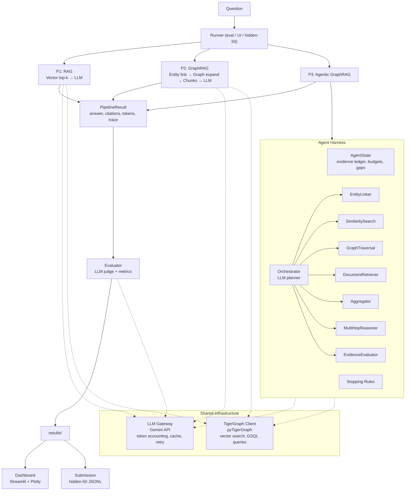
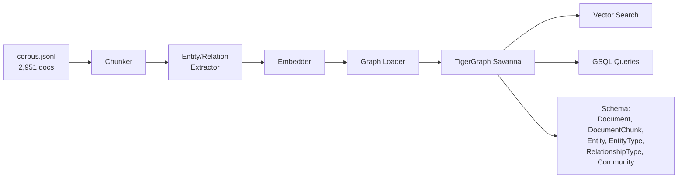

# Architecture

## System Overview

```mermaid
graph TB
    Q["Question"] --> Runner["Runner (eval / UI / hidden-50)"]
    
    Runner --> P1["P1: RAG<br/>Vector top-k → LLM"]
    Runner --> P2["P2: GraphRAG<br/>Entity link → Graph expand → Chunks → LLM"]
    Runner --> P3["P3: Agentic GraphRAG"]
    
    subgraph Harness["Agent Harness"]
        State["AgentState<br/>evidence ledger, budgets, gaps"]
        Orch["Orchestrator<br/>LLM planner"]
        Stop["Stopping Rules"]
        
        Orch --> EL["EntityLinker"]
        Orch --> SS["SimilaritySearch"]
        Orch --> GT["GraphTraversal"]
        Orch --> DR["DocumentRetriever"]
        Orch --> AG["Aggregator"]
        Orch --> MH["MultiHopReasoner"]
        Orch --> EV["EvidenceEvaluator"]
    end
    
    P3 --> Harness
    
    P1 --> PR["PipelineResult<br/>answer, citations, tokens, trace"]
    P2 --> PR
    P3 --> PR
    
    PR --> Eval["Evaluator<br/>LLM judge + metrics"]
    Eval --> Results["results/"]
    Results --> Dash["Dashboard<br/>Streamlit + Plotly"]
    Results --> Sub["Submission<br/>hidden-50 JSONL"]
    
    subgraph Shared["Shared Infrastructure"]
        GW["LLM Gateway<br/>Gemini API<br/>token accounting, cache, retry"]
        TG["TigerGraph Client<br/>pyTigerGraph<br/>vector search, GSQL queries"]
    end
    
    P1 -.-> GW
    P2 -.-> GW
    Harness -.-> GW
    Eval -.-> GW
    
    P1 -.-> TG
    P2 -.-> TG
    Harness -.-> TG
```

## Data Flow

```mermaid
graph LR
    Corpus["corpus.jsonl<br/>2,951 docs"] --> Chunk["Chunker"]
    Chunk --> Extract["Entity/Relation<br/>Extractor"]
    Extract --> Embed["Embedder"]
    Embed --> Load["Graph Loader"]
    Load --> TG["TigerGraph Savanna"]
    
    TG --> VS["Vector Search"]
    TG --> GS["GSQL Queries"]
    TG --> Schema["Schema:<br/>Document, DocumentChunk,<br/>Entity, EntityType,<br/>RelationshipType, Community"]
```

## Key Design Decisions
- See [DECISIONS.md](DECISIONS.md) for all ADRs
- ADR-001: Reuse TigerGraph GraphRAG schema + GSQL; write our own code
