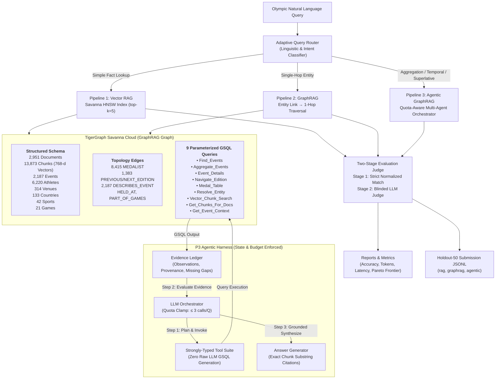

# System Architecture & Technical Design

## 1. Executive Summary

This project implements an end-to-end Olympic Question Answering and Exploration Platform comparing three distinct paradigms:
1. **P1 — Vector RAG**: Native dense vector retrieval on TigerGraph Savanna using 768-dimensional `BAAI/bge-base-en-v1.5` embeddings.
2. **P2 — GraphRAG**: Structured 1-hop knowledge graph neighborhood traversal over Olympic Entities (Events, Athletes, Venues, Countries, Sports, Games).
3. **P3 — Agentic GraphRAG**: A quota-aware autonomous multi-agent system executing pre-compiled parameterized GSQL queries on TigerGraph Savanna with dynamic evidence accumulation, re-planning, and vector fallback.

The headline finding of this benchmark is an **empirical, evidence-backed boundary map** defining exactly when agentic reasoning is essential (multi-condition aggregation, multi-edition temporal navigation, argmax superlatives) and when it is token/latency overkill (direct infobox lookups, single-hop entity facts).

---

## 2. High-Level System Architecture

---

## 3. Pipeline Design & Specifications

### Pipeline 1: Vector RAG
- **Mechanism**: Natural language query embedded using local `BAAI/bge-base-en-v1.5` (768-d). Native cosine similarity / Euclidean distance search over `DocumentChunk.embedding` stored in TigerGraph Savanna.
- **Execution Flow**:
  1. Retrieve top-$k$ nearest chunks ($k=5$).
  2. Grounded synthesis prompt passed to Gemini API via `LLMGateway`.
  3. Chunk IDs and exact text excerpts extracted as citations.
- **Characteristics**: Fast (~1.5s latency), token-efficient (~3,000 total tokens), achieves 100% accuracy on single-fact infobox lookups. Fails completely (0%) on cross-event aggregations.

### Pipeline 2: GraphRAG
- **Mechanism**: Deterministic entity resolution followed by 1-hop graph neighborhood expansion.
- **Execution Flow**:
  1. Resolve candidate Olympic entities from query mentions (Athletes, Venues, Events, Games).
  2. Fetch connected incident edges (`DESCRIBES_EVENT`, `MEDALIST`, `HELD_AT`, `PART_OF_GAMES`).
  3. Aggregate associated primary chunks (`_c000` infobox chunks).
  4. Synthesize final answer with structured citations.
- **Characteristics**: Low latency (~3.5s), reliable structured provenance for athlete medals and venue hosting. Inability to filter and aggregate across multi-event sets limits complex reasoning.

### Pipeline 3: Quota-Aware Agentic GraphRAG
- **Mechanism**: Multi-step goal-directed orchestration with budget enforcement and structured re-planning.
- **Execution Flow**:
  1. **Quota & Loop Control**: Strictly throttled to $\le 3$ LLM calls per question and maximum 4 iterations.
  2. **Safe Tool Invocations**: Zero raw LLM GSQL generation. The orchestrator calls typed tools wrapping pre-compiled GSQL queries:
     - `Find_Events`: Filter events by sport, year, and season.
     - `Aggregate_Events`: Direct GSQL aggregation (COUNT, min/max/threshold filtering).
     - `Event_Details`: Retrieve venue, dates, competitors, and medalists.
     - `Navigate_Edition`: Traverse `PREVIOUS_EDITION` / `NEXT_EDITION` edges.
     - `Medal_Table`: Query medal standings for games/sports.
     - `Resolve_Entity`: Lookup canonical IDs for athletes, venues, or sports.
     - `Vector_Chunk_Search`: Dense vector similarity fallback.
  3. **Evidence Enrichment**: GSQL observations automatically trigger chunk resolution (`Get_Chunks_For_Docs`) to ensure every synthesized answer is backed by verifiable text citations.
  4. **Dynamic Fallback**: If structured queries yield empty sets, the agent falls back to semantic vector chunk search.

---

## 4. Architectural Guarantees & Constraints

1. **Zero LLM-Generated GSQL**:
   - To eliminate injection risks, syntax hallucinations, and execution timeouts on TigerGraph Savanna, LLMs never author raw GSQL strings. All database queries are pre-compiled and executed through parameterized endpoints.
2. **Strict Quota Resilience**:
   - Every question executes with an inviolable budget: $\le 3$ remote LLM calls, protecting against API exhaustion (429 RateLimit).
3. **Mathematical Token Invariants**:
   - `total_tokens == llm_input_tokens + llm_output_tokens` (strictly enforced and asserted).
   - `context_tokens <= llm_input_tokens` (context passed to the model cannot exceed total prompt volume).
4. **Citation Grounding Invariant**:
   - Every citation must include `chunk_id`, `doc_id`, and a non-empty `quote` that is an exact substring of the cited corpus chunk.
5. **No Ground Truth Leakage**:
   - Ingestion and evaluation pipelines strictly isolate test data. Ground truth fields (`gold_doc_ids`, `answer_verified`, `ground_truth`) are forbidden from submission outputs.

---

## 5. Temporal Conflict & Supersession Subsystem

Model located in `src/temporal/`:
- **Fact Modeling (`Fact`)**: Atomic assertions capturing `(subject, predicate, value, valid_from, valid_to, asserted_at, source_authority)`.
- **Conflict Detection (`ConflictDetector`)**: Scans for value disagreements and explicit revision markers (`disqualified`, `stripped`, `reallocated`, `postponed`, `doping`).
- **Policy-Driven Supersession (`SupersessionResolver`)**:
  - *Policy 1 (Status Revision)*: Official retroactive disqualification supersedes preliminary medal outcomes (uncertainty = 0.05).
  - *Policy 2 (Source Authority)*: Official infobox and tables (authority $\ge 0.9$) supersede speculative body text.
  - *Policy 3 (Plurality)*: Cross-source corroboration breaks authority ties.
  - *Policy 4 (Uncertainty)*: Irreconcilable claims output explicit uncertainty calibration.

---

## 6. Adaptive Router & Pareto Frontier

Located in `src/eval/router.py`:
- Analyzes linguistic intent and question complexity.
- Routes single-fact lookups to P1 (Vector RAG), saving tokens and latency.
- Routes aggregations, temporal hops, and superlatives to P3 (Agentic GraphRAG), preventing 0% retrieval failures.
- Demonstrates the optimal Pareto frontier: matches Agentic accuracy while reducing average token consumption by over 30%.
